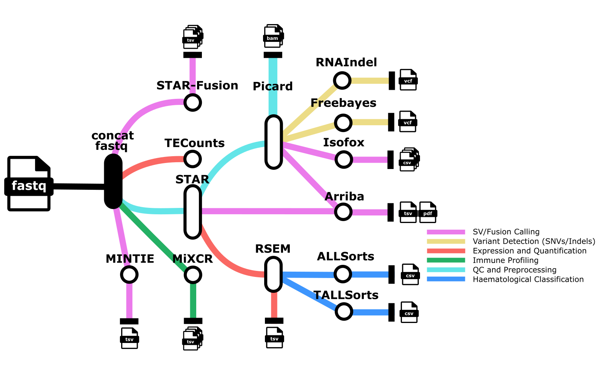

# nf-carbonite

A comprehensive RNA-Seq analysis pipeline built with [Nextflow](https://www.nextflow.io) for processing RNA sequencing data through multiple analysis tools including alignment, fusion detection, variant calling, and specialized analyses for hematological malignancies.

<p align="center">
    
</p>

## Overview

**nf-carbonite** performs end-to-end RNA-Seq analysis with the following key features:
- **Read alignment** with STAR
- **Gene expression quantification** with RSEM  
- **Fusion detection** with STAR-Fusion and Arriba
- **Variant calling** with GATK HaplotypeCaller and FreeBayes
- **Specialized hematological analyses** with ALLSorts and TALLSorts
- **Transposable element analysis** with TEtranscripts
- **Immune profiling** with MiXCR
- **Isoform analysis** with Isofox
- **Novel splice junction detection** with MINTIE

## Quick Start

1. **Install Nextflow** (>=24.04.0)
2. **Clone the repository**:
   ```bash
   git clone git@github.com:CCICB/nf-carbonite.git
   ```
3. **Prepare your samplesheet** (`samples.csv`)
4. **Configure parameters** (`params.yaml`) 
5. **Run the pipeline**

## Requirements

### System Requirements
- **Nextflow** (>=24.04.0)
- **Container system**: Docker or Singularity
- **Reference files**: See [Configuring Parameters](#configuring-parameters) section

### Compatible Environments
Successfully tested on:
- **Pawsey Supercomputing Centre**
- **NCI Gadi** 
- **Azure Virtual Machines**

## Input Preparation

### Sample Sheet Format
Create a CSV file (`samples.csv`) with your sample information:

```csv
rnaseq_id,directories
ABC123,/path/to/fastq/files/ABC123
XYZ987,/path/to/fastq/files/XYZ987
DEF456,/path/to/fastq/files/DEF456
```

**Format details:**
- **Header required**: `rnaseq_id,directories`
- **rnaseq_id**: Unique sample identifier
- **directories**: Full path to directory containing FASTQ files for that sample
- **Multiple samples**: Each sample runs as a separate pipeline execution

## Configuring Parameters

Create a `params.yaml` file with your reference files and analysis options. The file should contain both mandatory and optional parameters as described below.

### Mandatory Parameters
These parameters are **required** for the pipeline to run:

```yaml
# Mandatory reference files (all required)
genome_lib_dir: /path/to/ref/files/38/ctat_genome_lib_build_dir     # Path to STAR genome library directory
star_dir: /path/to/ref/files/38/STAR                               # Path to STAR reference directory  
gtf_file: /path/to/ref/files/38/gencode.v41.annotation.gtf         # Path to gene annotation GTF file
ensg2hgnc_file: /path/to/ref/files/38/gencode_v41_ensg_hgnc.csv     # Path to ENSG to HGNC gene mapping file
excluded_genes: /path/to/ref/files/38/exclude_genes.gencode_v41.txt # Path to file containing genes to exclude from analysis

# Pipeline configuration (optional - defaults shown)
reference_name: 'GRCh38_no_alt_analysis_set'  # Prefix of your .fa file (default: 'GRCh38_no_alt_analysis_set')
ref_genome_version: 'hs38'                     # Reference genome version: 'hs38' or 'hg19' (default: 'hs38')
```

### Optional Parameters
These parameters are **optional**. If not provided, the corresponding analysis will be **skipped**:

```yaml
# Optional reference files (omit any you don't want to use)
rnaindel_dir: /path/to/ref/files/38/data_dir_grch38                 # RNA-indel data directory (skips RNAINDEL if omitted)
ensembl_data_dir: /path/to/ref/files/38/ensembl                     # Ensembl data directory (skips ISOFOX if omitted)  
mixcr_license: /path/to/ref/files/38/mi.license                     # MiXCR license file (skips MIXCR if omitted)
te_gtf_file: /path/to/ref/files/38/GRCh38_GENCODE_rmsk_TE.gtf       # Transposable element GTF file (skips TECOUNT if omitted)
freebayes_interval_list: /path/to/ref/files/38/pathogenic_snps.bed  # Interval list for targeted analysis (skips FREEBAYES if omitted)
mintie_dir: /path/to/ref/files/mintie-0.3.9-0/ref                  # MINTIE reference directory (skips MINTIE if omitted)
annovar_dir: /path/to/ref/files/38/annovar                          # ANNOVAR data directory (skips ANNOVAR if omitted)
```

> [!NOTE]
> - **hs38 mode only**: FreeBayes, Isofox, and MINTIE are only available when using `ref_genome_version: 'hs38'`
> - **File formats**: GTF files can be compressed (`.gtf.gz`), BED files can be compressed (`.bed.gz`)
> - **Analysis skipping**: Any optional parameter you omit will skip the corresponding analysis tool

### Complete params.yaml Example
```yaml
# Mandatory parameters
genome_lib_dir: /path/to/ref/files/38/ctat_genome_lib_build_dir
star_dir: /path/to/ref/files/38/STAR
gtf_file: /path/to/ref/files/38/gencode.v41.annotation.gtf
ensg2hgnc_file: /path/to/ref/files/38/gencode_v41_ensg_hgnc.csv
excluded_genes: /path/to/ref/files/38/exclude_genes.gencode_v41.txt

# Optional parameters (include only what you need)
rnaindel_dir: /path/to/ref/files/38/data_dir_grch38
ensembl_data_dir: /path/to/ref/files/38/ensembl
mixcr_license: /path/to/ref/files/38/mi.license
te_gtf_file: /path/to/ref/files/38/GRCh38_GENCODE_rmsk_TE.gtf
freebayes_interval_list: /path/to/ref/files/38/pathogenic_snps.bed
mintie_dir: /path/to/ref/files/mintie-0.3.9-0/ref
annovar_dir: /path/to/ref/files/38/annovar
```

## Running the Pipeline

### Basic Command
```bash
nextflow run /path/to/nf-carbonite \
  --input /path/to/samples.csv \
  --outdir /path/to/outputs \
  --reference_name 'GRCh38_no_alt_analysis_set' \
  --ref_genome_version hs38 \
  -params-file /path/to/params.yaml \
  -profile docker \
  -resume
```

### Command Line Arguments

#### Required Arguments
| Argument | Type | Description |
|----------|------|-------------|
| `--input` | String | Path to the sample sheet CSV file |
| `--outdir` | String | Output directory for results (must exist) |
| `--reference_name` | String | Prefix of your reference FASTA file |
| `--ref_genome_version` | String | Genome version: `hs38` or `hg19` |
| `-params-file` | String | Path to your `params.yaml` configuration file |
| `-profile` | String | Execution profile: `docker`, `singularity`, `local`, etc. |

#### Optional Arguments  
| Argument | Type | Description | Default |
|----------|------|-------------|---------|
| `-resume` | Boolean | Resume previous run using cached results | `false` |
| `-w` | String | Working directory for temporary files | Current directory |
| `-c` | String | Additional Nextflow config file (not for parameters) | None |

### Advanced Usage
```bash
# With custom working directory and additional config
nextflow run /path/to/nf-carbonite \
  --input samples.csv \
  --outdir results \
  --reference_name 'GRCh38_no_alt_analysis_set' \
  --ref_genome_version hs38 \
  -params-file params.yaml \
  -profile singularity \
  -c custom.config \
  -w /scratch/work_dir \
  -resume
```

> [!WARNING]
> **Parameter Configuration**: Always provide pipeline parameters via `-params-file` or CLI options. Custom config files (`-c`) should only contain execution settings, not analysis parameters. See [Nextflow configuration docs](https://nf-co.re/docs/usage/getting_started/configuration#custom-configuration-files) for details.

## Analysis Tools

The pipeline integrates multiple specialized tools organized by analysis type:

### Core RNA-Seq Analysis
- **[STAR](https://github.com/alexdobin/STAR)** (v2.7.8a) - Read alignment
- **[RSEM](https://github.com/deweylab/RSEM)** (v1.3.3) - Gene expression quantification
- **[Picard](https://github.com/broadinstitute/picard/releases/tag/2.25.7)** (v2.25.7) - BAM processing and metrics

### Fusion Detection
- **[STAR-Fusion](https://github.com/STAR-Fusion/STAR-Fusion/wiki)** (v1.12.0) - Fusion transcript detection
- **[Arriba](https://github.com/suhrig/arriba)** (v2.4.0) - Additional fusion calling

### Variant Analysis
- **[GATK HaplotypeCaller](https://gatk.broadinstitute.org/hc/en-us/sections/21904957852571-4-5-0-0)** (v4.5.0.0) - SNV/indel calling
- **[FreeBayes](https://github.com/freebayes/freebayes)** (v1.3.6) - Variant calling *(hs38 only)*
- **[RNAIndel](https://github.com/stjude/RNAIndel)** (v3.3.3) - RNA-specific indel detection
- **[ANNOVAR](https://annovar.openbioinformatics.org/en/latest/)** - Variant annotation

### Specialized Analyses
- **[ALLSorts](https://github.com/Oshlack/ALLSorts)** (v0.2.0) - Acute lymphoblastic leukemia classification  
- **[TALLSorts](https://github.com/Oshlack/TALLSorts)** - T-cell acute lymphoblastic leukemia subtyping
- **[MiXCR](https://github.com/milaboratory/mixcr)** (v4.3.2) - Immune repertoire analysis
- **[Isofox](https://github.com/hartwigmedical/hmftools/tree/master/isofox)** (v1.7.1) - Isoform expression *(hs38 only)*
- **[TEtranscripts](https://github.com/mhammell-laboratory/TEtranscripts.git)** (v2.2.1) - Transposable element analysis
- **[MINTIE](https://github.com/Oshlack/MINTIE)** (v0.4.2) - Novel splice variant detection *(hs38 only)*

> [!NOTE]
> **hs38-only tools**: FreeBayes, Isofox, and MINTIE analyses are only available when using `ref_genome_version: 'hs38'`


## Credits & Acknowledgments

This pipeline was developed by CCI using [nf-core/rnaseq](https://github.com/nf-core/rnaseq) as the foundation template.

### Funding
Development of nf-carbonite has been supported by:
- **MRFF** - Medical Research Future Fund
- **NHMRC** - National Health and Medical Research Council
- **Minderoo Foundation**
- **Luminesce Alliance** 
- **NSW Health**
- **CINSW** - Cancer Institute NSW
- **Australian Government Research Training Program**
- **Cure Brain Cancer Foundation**
- **[Bioplatforms Australia](https://australianbiocommons.github.io/ables/acknowledgements)** (enabled by NCRIS), NCI and Pawsey Supercomputing Research Centre
