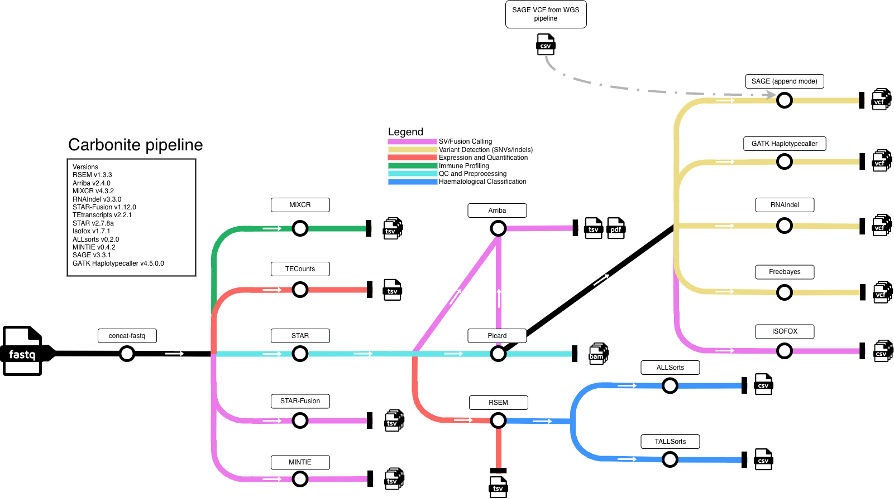

## Introduction

**nf-carbonite** is a RNA-Seq analysis workflow. 

The pipeline is built by CCI using [Nextflow](https://www.nextflow.io), a workflow tool to run tasks across multiple compute infrastructures.
<p align="center">
    
</p>

## Tools
   - STAR (v2.7.8a) - https://github.com/alexdobin/STAR
   - STAR-Fusion (v1.12.0) - https://github.com/STAR-Fusion/STAR-Fusion/wiki
   - TEtranscripts  (v2.2.1) - https://github.com/mhammell-laboratory/TEtranscripts.git
   - MiXCR (v4.3.2) - https://github.com/milaboratory/mixcr
   - Arriba (v2.4.0) - https://github.com/suhrig/arriba
   - RNAIndel (v3.3.3) - https://github.com/stjude/RNAIndel
   - RSEM (v1.3.3) - https://github.com/deweylab/RSEM
   - Picard tools (v2.25.7) - https://github.com/broadinstitute/picard/releases/tag/2.25.7
   - ALLSorts (v0.2.0) - https://github.com/Oshlack/ALLSorts
   - TALLSorts - https://github.com/Oshlack/TALLSorts
   - Isofox (v1.7.1) - https://github.com/hartwigmedical/hmftools/tree/master/isofox
   - Freebayes (v1.3.6) - https://github.com/freebayes/freebayes
   - GATK Haplotypecaller (v4.5.0.0) - https://gatk.broadinstitute.org/hc/en-us/sections/21904957852571-4-5-0-0
   - ANNOVAR - https://annovar.openbioinformatics.org/en/latest/
   - MINTIE (v0.4.2) - https://github.com/Oshlack/MINTIE

> [!NOTE]
> Freebayes, Isofox, and MINTIE are only available in hs38 mode

## Credits

[nf-core/rnaseq](https://github.com/nf-core/rnaseq) was used as the template. 

## Compatible Envirnments

As of 17th September 2024, nf-carbonite has been successfully tested on:
- Pawsey
- NCI Gadi
- Azure VM

## Requirements
- Nextflow (>=24.04.0)
- Either Docker or Singularity
- Genome reference files

## Installation
```bash
# Example installation commands
git clone git@github.com:CCICB/nf-carbonite.git
```

## Usage
Create a samplesheet with your inputs in `samples.csv`:
```
rnaseq_id,directories
ABC123,/path/2/fastq/files/ABC123
XYZ987,/path/2/fastq/files/XYZ987
```
Muliple samples can be added to a single samplesheet, but a different run will be started for each sample. 

Launch `nf-carbonite`:

```
nextflow run /path/to/nf-carbonite \
--outdir /path/to_outputs \
--input /path/to/samples.csv \
--reference_name 'GRCh38_no_alt_analysis_set' \
--ref_genome_version <hs38/hg19> \
-params-file=/path/to/params.yaml \
-profile <docker|singularity|...> \
-c </your/custom/config/file> \
-w /path/to/work/dir -resume
```

> [!WARNING]
> Please provide pipeline parameters via the CLI or Nextflow `-params-file` option. Custom config files including those provided by the `-c` Nextflow option can be used to provide any configuration _**except for parameters**_; see [docs](https://nf-co.re/docs/usage/getting_started/configuration#custom-configuration-files).

For more details and further functionality, please refer to the [usage documentation](https://nf-co.re/oncoanalyser/usage) and the [parameter documentation](https://nf-co.re/oncoanalyser/parameters).

`params.yaml`:
```
mixcr_license : /path/to/ref/files/38/mi.license
genome_lib_dir : /path/to/ref/files/38/ctat_genome_lib_build_dir
star_dir : /path/to/ref/files/38/STAR
gtf_file : /path/to/ref/files/38/gencode.v41.annotation.gtf
te_gtf_file : /path/to/ref/files/38/GRCh38_GENCODE_rmsk_TE.gtf
rnaindel_dir : /path/to/ref/files/38/data_dir_grch38
ensembl_data_dir : /path/to/ref/files/38/ensembl
annovar_dir : /path/to/ref/files/38/annovar
mintie_dir : /path/to/ref/files/mintie-0.3.9-0/ref
```

### Required Arguments

| Argument                | Type     | Description                                                     |
|-------------------------|----------|-----------------------------------------------------------------|
| `--input`               | `String` | Path to the sample sheet. See Documentation for correct format  |
| `--outdir`              | `String` | Path to save the output. The directory must exist beforehand.   |
| `--profile`             | `String` | Name of configuration profiles. E.g. docker, singularity, local |
| `--reference_name`      | `String` | Prefix of your .fa file i.e. GRCh38_no_alt_analysis_set         |
| `--ref_genome_version`  | `String` | Reference genome version. Either hs38 or hg19                   |
| `-params-file`          | `String` | Path to params.yaml file. See example in documentation          |


### Optional Arguments

| Argument          | Type    | Description                                                           | Default Value |
|-------------------|---------|-----------------------------------------------------------------------|---------------|
| `-resume`         | `Boolean` | Enables reuse of process results                                      | `false`       |
| `-w`              | `String`  | Path to working directory                                             | <Curent dir>  |
| `-c`              | `String`  | Custom config files. Note: Not for parameters.                        | None          |
